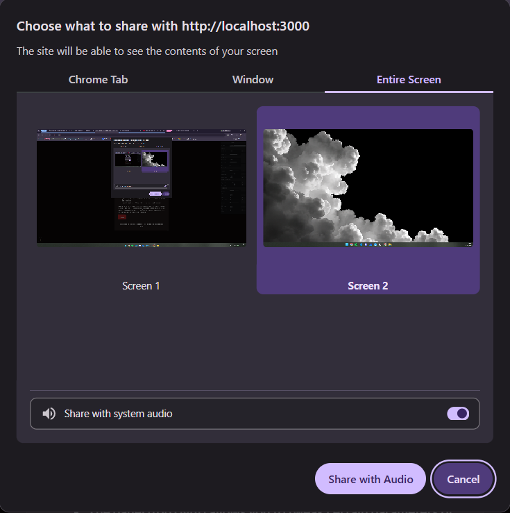
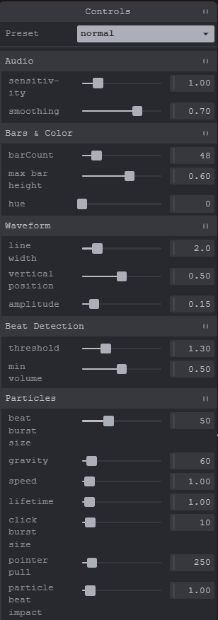

## Interactive System Audio Visualizer
https://a4-owen-nguyen.onrender.com/

This application is a user-interactive audio-reactive visualizer built using the Web Audio API and Canvas. It captures audio playing on your computer (whether that is in another application, or another tab)
and generates an audio-reactive bar with beat-triggered particle effects AND a waveform display to visualize the music in real time. This application is user interactive too; particles are drawn towards the
user's mouse, users can create particle bursts by clicking, and users can augment certain parameters of the audio visualizer. 

**GOAL**
- Visualize live system audio
- Turn it into a frequency display (bars) and a waveform display
- Implement beat detection based on the average volume of the bass frequency, which affects particle settings
- Allow users to fine-tune the application to their liking, while also including some visualization presets

**CHALLENGES**
- Mapping frequency data into visually appealing bars required logarithmic spacing
- Implementing beat detection was difficult; compares the current bass energy to its own recent average, filtered by a threshold
- Getting system audio to work was buggy, until I figured out certain audio drivers like my Logitech PRO X Headset's block system audio
with a 'NotReadableError'. In these cases, switching to a different audio output or simply switching to tab audio seemed like it did the trick.

**STARTING INSTRUCTIONS**
1. Press `Start` and choose `Entire Screen` in the share dialog.
2. Tick `Share with system audio`.
3. Play music anywhere on your computer!
- Works best in desktop Chrome or Edge. Nothing is recorded or saved. If sharing fails with a "Your audio device blocked sharing" error, try a 
different output device, share a browser tab instead of Entire Screen, or use the demo sound below. This is due to possible driver and browser limitations.

**CONTROLS**
- Moving your pointer will pull particles toward it affected by the `pointer pull` setting.
- Clicking/holding your pointer will spawn a burst of particles affected by the `pointer burst size` setting.
- The panel (top right) allows you to tweak certain parameters of the audio visualizer. 3 Presets come included (Normal, Crazy, Chill).
- The help button (bottom left) reopens these instructions.

**PANEL PARAMETERS**

- `sensitivity`: Amplifies how much bars react to volume
- `smoothing`: Audio smoothing; a lower value means more jittery bars
- `barCount`: Number of displayed bars
- `max bar height`: Caps bar height as a fraction of screen height
- `hue`: Base color of bars and particles
- `line width`: Thickness of waveform line
- `vertical position`: Vertical position of waveform line
- `amplitude`: How far vertically above/below center the waveform swings 
- `threshold`: How far above its recent average bass must spike (in volume) to register as a "beat"
- `min volume`: Minimum bass level required for a "beat"
- `beat burst size`: Base particle count spawned per "beat" (however, it is scaled by bass volume)
- `gravity`: Downward pull of particles
- `speed`: Multiplier on particle launch velocity
- `lifetime`: Multiplier on how long particles last before fading
- `click burst size`: Base particle count spawned per user mouse click / each frame while holding pointer down (however, it is scaled by bass volume)
- `pointer pull`: Strength of particle pull towards user mouse
- `particle beat impact`: How strongly bass loudness scales burst size and speed on a "beat"